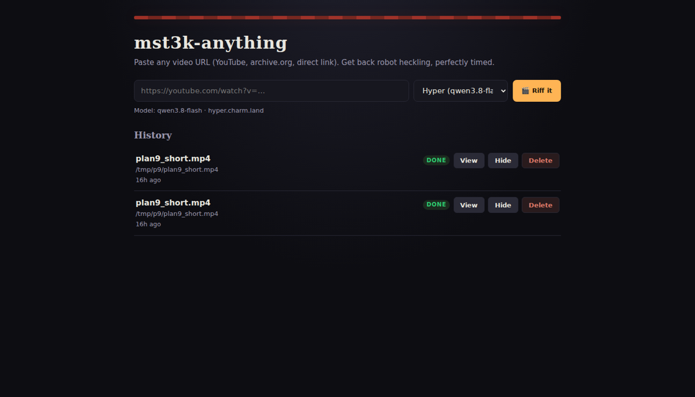
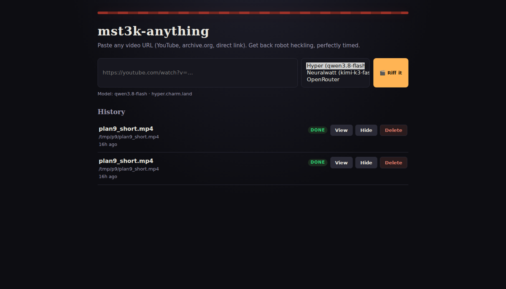
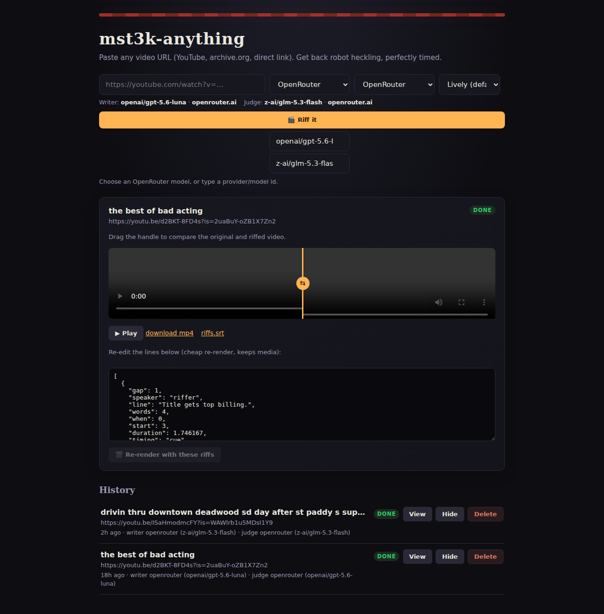

# mst3k-anything

> Paste a video URL. Get back a robot-heckled version, perfectly timed against the
> original audio — with a procedural theater strip along the bottom.



**What it does.** Downloads a video, builds a dense plan of potential riff cues from
cadence, visual changes, audio energy, and natural pauses, transcribes the speech,
figures out what's on screen and what led into each cue, asks an LLM to write
context-specific jokes and callbacks, synthesizes them with PocketTTS in two voices,
sidechain-ducks the original audio, and mixes the riffs in. Dialogue overlap is an
intentional option; timing windows guide the landing rather than vetoing a good joke.
For new users, start with the **[installation guide](docs/INSTALL.md)**; it covers Linux,
macOS, and Windows from prerequisite installation through the first WebUI job.





## Example output

[](docs/examples/deadwood-relentless/deadwood-relentless-riffed.mp4)
[](docs/examples/deadwood-relentless/deadwood-relentless-gemma31b-grok46-riffed.mp4)

The [`Deadwood` Relentless comparison](docs/examples/deadwood-relentless/) contains two
complete 4:50 runs using density bias `4`. The Luna pair rendered 27/27 riffs; the
Gemma 31B writer + Grok 4.6 judge pair rendered 26/27 because its final cue reached the
video boundary. Both MP4s, SRTs, and final `riffs.json` manifests are included.

## Informal model notes

The first informal impression favored **GPT-5.6 Luna** (`openai/gpt-5.6-luna`) for
writing and joke landing, with **GLM-5.3 Flash** (`z-ai/glm-5.3-flash`) next and **Qwen
3.8 Flash** / **Kimi-k3-fast** generally weaker in those runs. The new Deadwood
comparison suggests the **Gemma 4 31B writer + Grok 4.6 judge** pairing can be roughly
on par with Luna on this source, so this is not a strict model ranking. It is an
informal observation, not a controlled benchmark; model pair, prompt/cache state, and
source material can change the result.

## Highlights

- **Context-sensitive riffing** — the writer receives timestamped *pre* and *mid* frames
  for each cue plus transcript completed through the cue. A whole-video analyst profile
  supplies continuity, motifs, and callback candidates; prompts prohibit using later
  reveals as if the audience has seen them.
- **Dense, evidence-first cueing** — cadence keeps the show alive even over continuous
  dialogue; silence, quietness, scene changes, audio energy, and visual signals shape
  cue scoring rather than acting as hard gates. Riff density ranges from Sparse through
  Relentless.
- **CPU-safe long-form ASR** — Parakeet processes audio in bounded 60-second worker
  chunks with per-chunk cache files, so long videos do not feed one unbounded offline
  decode stream and exhaust host memory.
- **Graceful edge cases** — short clips get a proportional lead-in, video-only inputs
  produce riffs over generated silence, and corrupt/stale cache artifacts are rejected
  rather than mixed into a new job.
- **Real-time log** — after submitting a URL the UI immediately shows a console
  tailing the pipeline stage-by-stage. It follows the newest output, briefly allows
  manual scrolling, then returns to the live tail; failed-job logs remain visible.
  When done the video player appears.
- **Edit + re-render** — open a finished job, edit the final rendered riff manifest in
  the browser, hit re-render; the submitted manifest is used directly (no fresh LLM
  rewrite), while cached media analysis/transcription is retained.
- **Stable job lifecycle** — each API submission gets a private work directory, while
  the database slug becomes a human title slug after ingest. Repeated submissions of
  the same video cannot overwrite each other's logs, PIDs, or outputs.
- **Multi-provider LLM** — pick Hyper, Neuralwatt, or OpenRouter; each provider can
  expose a high-context multimodal model catalog for both Writer and Judge, while blank
  Hyper/Neuralwatt overrides fall back to their `.env` defaults.
- **Provider-resilient structured LLM calls** — empty content, structured content blocks,
  truncated JSON, and transient provider failures are retried for every provider. Provider-
  specific reasoning controls are applied only when known-supported or explicitly configured.

## Stack

| Layer | Tech | Notes |
|---|---|---|
| Ingest | yt-dlp | YouTube, archive.org, direct mp4 links |
| Audio analysis | ffmpeg (silencedetect + astats) | gap detection, hot moments |
| Transcription | sherpa-onnx + Parakeet 110M INT8 | CPU-only, RTF 0.05 |
| Video analysis | ffmpeg frame grabs + signalstats | shot context, luma variance |
| Comedy brain | any OpenAI-compatible chat-completions API | system prompt templates per content kind |
| Voices | PocketTTS | built-in voices (alba/jane) by default; optional CLI custom reference conditioning via `VOICE_REF` |
| Mix | ffmpeg sidechaincompress + overlay | animated theater via static PNG (default) |
| Service | FastAPI + uvicorn + SQLite | the web UI / job queue |
| Setup | Python installer/doctor/start scripts | Linux, macOS, and Windows |

## Quick start — Linux, macOS, or Windows

For a copy-and-paste setup, use the **[complete installation guide](docs/INSTALL.md)**.
The short version is:

1. Install `ffmpeg`/`ffprobe` using your OS package manager.
2. Clone or download this repository.
3. Run the installer; it creates the three Python environments, installs dependencies,
   downloads the Parakeet ASR model, and creates `.env`:

```bash
# Linux/macOS
./scripts/install.sh

# Windows PowerShell (use a process-only policy change if needed)
Set-ExecutionPolicy -Scope Process -ExecutionPolicy Bypass
.\scripts\install.ps1
```

4. Enter one Hyper, Neuralwatt, or OpenRouter API key when prompted. To configure later,
   run `python3 scripts/configure.py` (Linux/macOS) or `py -3 scripts/configure.py`
   (Windows). Keys stay in the local `.env` and are never sent through the browser.
5. Check the setup and start the WebUI:

```bash
# Linux/macOS
python3 scripts/doctor.py --strict
./scripts/start.sh

# Windows PowerShell
py -3 scripts/doctor.py --strict
.\scripts\start.ps1
```

Open **http://127.0.0.1:8000**, choose a provider/model, paste a video URL, and submit.
The WebUI accepts YouTube, archive.org, other yt-dlp-supported URLs, direct video-file
URLs, and local video paths. If port 8000 is busy, use `./scripts/start.sh --port 8765`
or `.\scripts\start.ps1 --port 8765`.

The installer is the supported path for new users; it does not require `uv`, Docker, a
GPU, or manual virtual-environment activation. See [`docs/INSTALL.md`](docs/INSTALL.md)
for prerequisites, troubleshooting, CLI usage, custom paths, and the Linux-only systemd
notes.


### Optional custom voice (CLI/global configuration for now)

Before the first custom voice export, sign in to the gated [PocketTTS model
page](https://huggingface.co/kyutai/pocket-tts) if its current access conditions require
it. Authenticate the environment that owns `pocket-tts`:

```bash
# Linux/macOS
tts-venv/bin/hf auth login
tts-venv/bin/hf auth whoami

# Windows PowerShell
tts-venv\Scripts\hf.exe auth login
tts-venv\Scripts\hf.exe auth whoami
```

PocketTTS voice cloning is not exposed in the WebUI yet, but the CLI can use a local,
consented reference recording through `VOICE_REF`. The model page's current access and
acceptable-use conditions apply, and the reference must be lawfully usable with explicit
consent for voice conditioning. Do not clone named MST3K performers or characters.

PocketTTS's [`export-voice` command](https://github.com/kyutai-labs/pocket-tts/blob/main/docs/CLI%20Commands/export_voice.md)
processes the first 30 seconds of the reference and writes a reusable `.safetensors`
conditioning state, so use a clean, representative sample.

Precompute a reusable conditioning state:

```bash
# Linux/macOS
PYTHONPATH=src web-venv/bin/python -m mst3k.cli prepare-voice \
  /absolute/path/to/consented-reference.wav \
  --out /absolute/path/to/my-riffer.safetensors

# Windows PowerShell
$env:PYTHONPATH = "src"
.\web-venv\Scripts\python.exe -m mst3k.cli prepare-voice `
  C:\path\to\consented-reference.wav `
  --out C:\path\to\my-riffer.safetensors
```

Then set `VOICE_REF` in `.env` to either that `.safetensors` file or the original WAV
(the latter is exported automatically to the platform cache on first CLI render):

```bash
VOICE_REF=/absolute/path/to/my-riffer.safetensors
VOICE_PITCH=0.0   # semitone offset applied after conditioning
VOICE_RATE=1.0    # delivery-rate multiplier
```

The built-in pool is also colored: Alba is neutral and Jane is currently +2 semitones.
`VOICE_PITCH` adds a global offset to either built-in voice or a custom reference, while
`VOICE_RATE` scales delivery speed. Writer emphasis marks and fit-related tempo changes
are applied afterward. If the built-ins feel too bright/robotic, try `VOICE_PITCH=-1.0`
and `VOICE_RATE=0.96`; a custom voice starts from its own recording and receives only
those configured/output-stage transforms. Custom voice selection is currently CLI/.env
based. For a one-off CLI render, the same settings are available as `--voice-ref`,
`--voice-pitch`, and `--voice-rate` flags instead of editing `.env`. WebUI upload,
consent, previews, and per-job voice controls are planned rather than implemented.


The hosted demo uses systemd (see `deploy/mst3k-anything.service`), but local users should
use `scripts/start.sh`, `scripts/start.ps1`, or `start.cmd`. The service unit contains
VM-specific paths and is not a portable install recipe. The CLI also works directly;
the installer and requirements files are the supported dependency setup.

## Repo layout

```
src/mst3k/        pipeline modules (ingest, analyze, transcribe, context,
                  understand, writer, voice // tts, mix, llm, providers)
app/              FastAPI service + static UI (index.html)
scripts/          cross-platform install, doctor, configure, and start helpers
requirements-*.txt dependency sets for WebUI, ASR, and TTS
deploy/           VM-specific systemd unit (Linux only)
demo/, jobs/      runtime artifacts (git-ignored)
models/           ASR model weights (git-ignored)
docs/             INSTALL, PLAN, README shots, and the completed Deadwood example
```

## License

MIT (LICENSE), with `NOTICE` for upstream credits.
