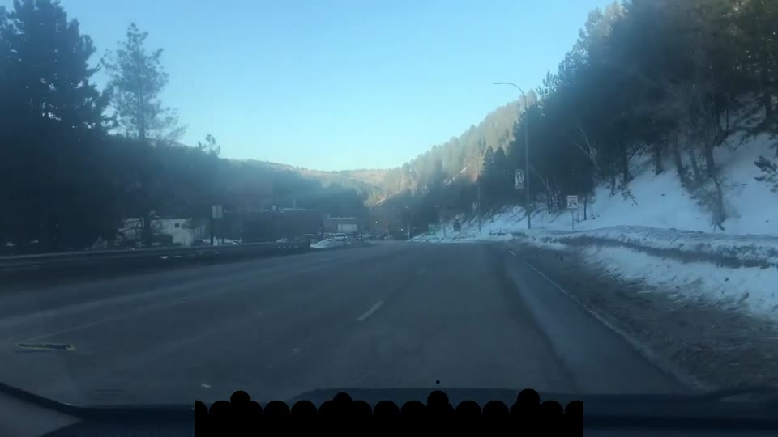

# Deadwood — Relentless comparison

These are three completed `mst3k-anything` runs of the same supplied Deadwood driving
video using the **Relentless** density setting (bias `4`). They are a qualitative,
anecdotal comparison of different multimodal writer/judge pairings—not a controlled
benchmark.

## Anecdotal ranking for this clip

1. [**1st place — Gemini Flash 3.8 writer + DeepSeek V4 Flash Vision judge**](deadwood-relentless-gemini38-deepseekv4-riffed.mp4)
2. [**2nd place — GPT-5.6 Luna writer + judge**](deadwood-relentless-riffed.mp4)
3. [**3rd place — Gemma 4 31B writer + Grok 4.6 judge**](deadwood-relentless-gemma31b-grok46-riffed.mp4)

| Place | Writer | Judge | Planned cues | Rendered riffs | Judge rewrites |
|---|---|---|---:|---:|---:|
| 1 | OpenRouter `google/gemini-3.8-flash` | OpenRouter `deepseek/deepseek-v4-flash-vision-exp` | 27 | 27 | 0 |
| 2 | OpenRouter `openai/gpt-5.6-luna` | same | 27 | 27 | 8 |
| 3 | OpenRouter `google/gemma-4-31b-it` | OpenRouter `x-ai/grok-4.6` | 27 | 26 | 23 |

All three source renders are about 4:50 at 1280×720. The third-place run's final cue
reached the physical video boundary and was omitted from its rendered manifest; its job
still completed successfully.

## Why the first-place run stood out

Gemini Flash 3.8 was unusually funny on this source, with deeper turns and excellent
context use. The DeepSeek judge retained all 27 riffs and requested no rewrites, so the
strong result appears more attributable to the Gemini writer than to judge rewrites.
That is an inference from one run, not an isolated model evaluation.

The Gemini/DeepSeek combination was roughly **4–5× more expensive** than the more
value-oriented model combinations, based on the observed provider pricing/usage. The
application does not currently record an exact per-job cost. **Sol and Fable were not
tested.**

## Files

- [`deadwood-relentless-gemini38-deepseekv4-riffed.mp4`](deadwood-relentless-gemini38-deepseekv4-riffed.mp4) — first-place video
- [`deadwood-relentless-gemini38-deepseekv4-riffs.srt`](deadwood-relentless-gemini38-deepseekv4-riffs.srt) — first-place subtitles
- [`deadwood-relentless-gemini38-deepseekv4-riffs.json`](deadwood-relentless-gemini38-deepseekv4-riffs.json) — first-place manifest
- [`deadwood-relentless-riffed.mp4`](deadwood-relentless-riffed.mp4) — second-place video
- [`deadwood-relentless-riffs.srt`](deadwood-relentless-riffs.srt) — second-place subtitles
- [`deadwood-relentless-riffs.json`](deadwood-relentless-riffs.json) — second-place manifest
- [`deadwood-relentless-gemma31b-grok46-riffed.mp4`](deadwood-relentless-gemma31b-grok46-riffed.mp4) — third-place video
- [`deadwood-relentless-gemma31b-grok46-riffs.srt`](deadwood-relentless-gemma31b-grok46-riffs.srt) — third-place subtitles
- [`deadwood-relentless-gemma31b-grok46-riffs.json`](deadwood-relentless-gemma31b-grok46-riffs.json) — third-place manifest

The videos are generated examples, not claims of ownership over the underlying source
footage. Use source material responsibly.
